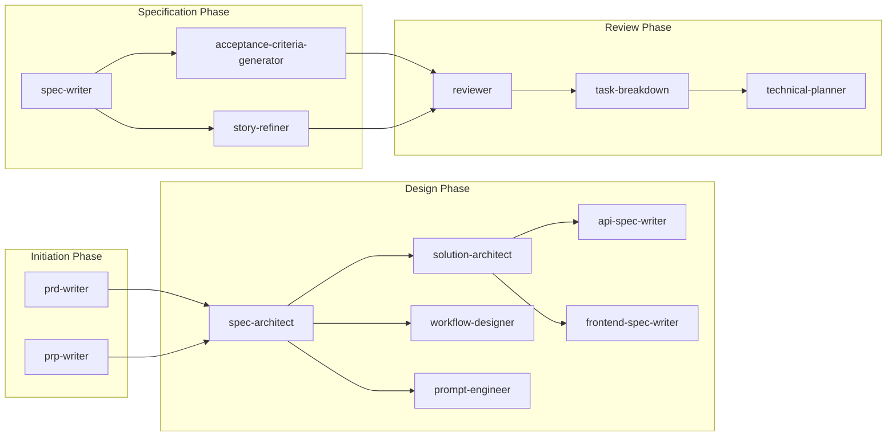
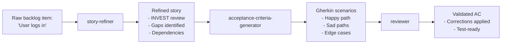
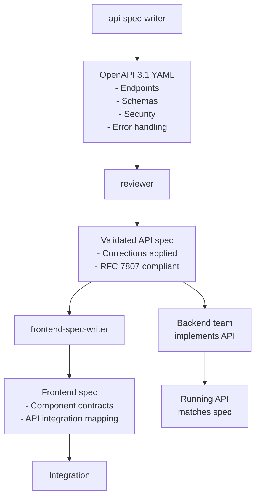
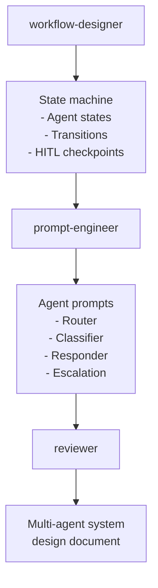
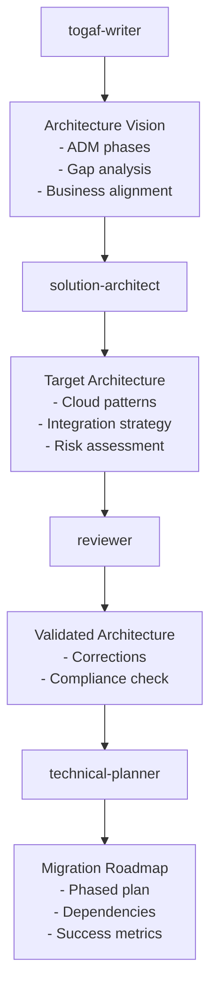

# Workflows Guide

Practical examples of chaining skills together to execute professional software development cycles. Each workflow shows a real scenario, the skill sequence, and the artifacts produced.

## Quick Reference: Skill Relationships



## Workflow 1: From Product Idea to Ready-to-Implement Spec

**Use case:** A product manager presents a vague feature idea. The goal is to produce a complete, reviewed, implementation-ready specification.

**Skills used:** `prd-writer` → `spec-architect` → `spec-writer` → `reviewer` → `task-breakdown` → `technical-planner`

```mermaid
flowchart TD
    A["Product Manager:\n'We need a notification system'"] --> B[prd-writer]
    B --> C["PRD Document\n- User stories\n- Success criteria\n- Scope\n- Risks"]
    C --> D[spec-architect]
    D --> E["System Specification\n- Module boundaries\n- Contracts\n- Constraints"]
    E --> F[spec-writer]
    F --> G["detailed.spec.md\n- Verifiable requirements\n- Guardrails\n- Validation plan"]
    G --> H[reviewer]
    H --> I["Review Report\n- Issues\n- Severity\n- Corrections"]
    I --> J{task-breakdown]
    J --> K["Task List\n- Execution waves\n- Dependencies\n- Ownership"]
    K --> L[technical-planner]
    L --> M["Technical Roadmap\n- Phases\n- MVP scope\n- Coordination points"]
```

**Step-by-step:**

### Step 1: Create the PRD

**Agent prompt:**
```
Load the prd-writer skill. A product manager wants to add an in-app notification
system to an existing SaaS platform. The idea is: "Users should be able to
subscribe to events from their dashboard and receive real-time alerts." Produce
a complete PRD.
```

**Output:** `notification-system-prd.md` — Product Requirements Document with user stories, success metrics, scope boundaries, risk assessment, and implementation roadmap.

---

### Step 2: Design the System Architecture

**Agent prompt:**
```
Load the spec-architect skill. Use the notification-system-prd.md as input.
Design the high-level system specification covering: event subscription
module, notification delivery service, user preference store, and the
external webhook integration points. Produce module boundaries, contracts,
and verification criteria.
```

**Output:** `notification-system-architecture.spec.md` — Architecture specification with C4-style component boundaries, interface contracts between modules, constraints (latency, delivery guarantees), and acceptance criteria.

---

### Step 3: Write the Detailed Specification

**Agent prompt:**
```
Load the spec-writer skill. Transform the notification-system-architecture.spec.md
into a detailed implementation-ready SPEC.md file. Every requirement must be
verifiable. Include guardrails for rate limiting, retry logic, and dead-letter
queue handling. Define the validation plan.
```

**Output:** `notification-system.spec.md` — Detailed specification with numbered requirements, guardrails, and a validation plan.

---

### Step 4: Review the Specification

**Agent prompt:**
```
Load the reviewer skill. Audit notification-system.spec.md for:
- Consistency and completeness
- Ambiguous requirements
- Missing edge cases
- Standards compliance
Return a structured review with severity levels and suggested corrections.
```

**Output:** `notification-system-review.md` — Structured audit with issues categorized by severity (Critical, High, Medium, Low) and concrete correction suggestions.

---

### Step 5: Break Down into Tasks

**Agent prompt:**
```
Load the task-breakdown skill. Use the reviewed notification-system.spec.md
and notification-system-review.md to produce execution waves. Identify
parallelizable tasks, dependencies, ownership, and acceptance signals.
```

**Output:** `notification-system-tasks.md` — Task breakdown with execution waves, parallelization guidance, and ownership assignments.

---

### Step 6: Plan Technical Execution

**Agent prompt:**
```
Load the technical-planner skill. Transform the task list into a phased
technical execution roadmap. Define MVP scope, infrastructure foundations,
coordination points, and incremental architecture delivery phases.
```

**Output:** `notification-system-roadmap.md` — Phased roadmap with MVP scope definition, technical milestones, and delivery timeline.

---

## Workflow 2: User Story to Testable Implementation

**Use case:** A developer has a backlog item that is too vague. Transform it into refined stories with acceptance criteria ready for development.

**Skills used:** `story-refiner` → `acceptance-criteria-generator` → `reviewer`



**Step-by-step:**

### Step 1: Refine the Story

**Agent prompt:**
```
Load the story-refiner skill. Refine this backlog item:
"As a user I want to log in so that I can access my dashboard."

Produce: INVEST review, identified gaps, acceptance criteria structure,
negative scenarios, assumptions, and open questions.
```

**Output:**
```gherkin
## Refined Story
Title: User authentication with email and password

## INVEST Review
- Independent: Yes
- Negotiable: Yes — MFA can be added as extension
- Valuable: Yes — core security feature
- Estimable: Yes — 3 story points
- Testable: Yes — AC defined below

## Gaps
- No session timeout defined
- No "remember me" option specified
- Password reset flow not linked

## Assumptions
- Email validation is handled by the auth provider
- JWT tokens expire after 1 hour

## Open Questions
- Should failed login attempts trigger account lockout?
```

---

### Step 2: Generate Acceptance Criteria

**Agent prompt:**
```
Load the acceptance-criteria-generator skill. Transform the refined story
into precise, verifiable Gherkin acceptance criteria with Happy Path, Sad Path,
and edge case scenarios.
```

**Output:**
```gherkin
Feature: User Authentication

Scenario: Successful login with valid credentials
  Given the user is on the login page
  And the user has a registered account with email "user@example.com" and password "ValidPass123"
  When the user enters "user@example.com" in the email field
  And the user enters "ValidPass123" in the password field
  And the user clicks the "Sign In" button
  Then the user is redirected to the dashboard
  And a session token is created and stored

Scenario: Failed login with incorrect password
  Given the user is on the login page
  And the user has a registered account with email "user@example.com" and password "ValidPass123"
  When the user enters "user@example.com" in the email field
  And the user enters "WrongPassword" in the password field
  And the user clicks the "Sign In" button
  Then the user remains on the login page
  And an error message "Invalid email or password" is displayed
  And no session token is created

Scenario: Login attempt with unregistered email
  Given the user is on the login page
  When the user enters "unknown@example.com" in the email field
  And the user enters "AnyPassword123" in the password field
  And the user clicks the "Sign In" button
  Then the user remains on the login page
  And an error message "Invalid email or password" is displayed

Scenario: Login blocked after 5 consecutive failed attempts
  Given the user has failed 5 consecutive login attempts within the last 10 minutes
  When the user enters valid credentials
  Then the user remains on the login page
  And an error message "Account temporarily locked. Try again in 15 minutes." is displayed
  And the "Sign In" button is disabled for 15 minutes
```

---

### Step 3: Validate

**Agent prompt:**
```
Load the reviewer skill. Audit the Gherkin scenarios for:
- Consistency with the original story intent
- Missing edge cases
- Ambiguous steps
- Testability
Return a structured review with corrections.
```

---

## Workflow 3: API-First Development

**Use case:** A team needs to build a backend service. Design the API contract first so frontend and backend can work in parallel.

**Skills used:** `api-spec-writer` → `reviewer` → `frontend-spec-writer`



**Step-by-step:**

### Step 1: Design the API Contract

**Agent prompt:**
```
Load the api-spec-writer skill. Design a complete API for a task management service.
Requirements:
- Users can create, read, update, delete tasks
- Tasks have: id, title, description, status (todo/in_progress/done), assignee, due_date
- Supports pagination (cursor-based), filtering by status and assignee
- JWT authentication required
- Rate limiting: 100 requests/minute per user

Produce OpenAPI 3.1 YAML with endpoints, request/response schemas, security schemes,
pagination, error handling with RFC 7807 problem details.
```

**Output:** `task-api.yaml` — Complete OpenAPI specification.

---

### Step 2: Review the API

**Agent prompt:**
```
Load the reviewer skill. Audit the task-api.yaml for:
- Completeness of endpoints and schemas
- Consistency between request/response schemas
- Security scheme correctness
- RFC 7807 compliance in error responses
- Missing error codes
```

---

### Step 3: Design the Frontend Integration

**Agent prompt:**
```
Load the frontend-spec-writer skill. Use the validated task-api.yaml to design
the frontend component integration. Produce:
- Component hierarchy for the task list view
- Props/events contracts for TaskCard, TaskForm, TaskList
- State management approach (local vs global)
- API integration mapping (which component calls which endpoint)
- Responsive breakpoints for mobile/tablet/desktop
- Accessibility rules (ARIA labels, keyboard navigation)
```

---

## Workflow 4: Multi-Agent System Design

**Use case:** A team wants to build an AI-powered customer support agent. Design the multi-agent orchestration before implementation.

**Skills used:** `workflow-designer` → `prompt-engineer` → `reviewer`



**Step-by-step:**

### Step 1: Design the Workflow

**Agent prompt:**
```
Load the workflow-designer skill. Design a customer support AI agent system with:
- Intent classification (refund, technical support, billing, general inquiry)
- Autonomous response for tier-1 queries
- Human-in-the-loop escalation for tier-2+ or sensitive topics (refunds > $500)
- Sentiment detection triggering priority escalation
- Retry logic with exponential backoff
- FSM states: IDLE, CLASSIFYING, RESPONDING, ESCALATING, RESOLVED

Produce: FSM state diagram, saga choreography for multi-step transactions,
HITL checkpoint definition, and resilience patterns.
```

---

### Step 2: Engineer the Prompts

**Agent prompt:**
```
Load the prompt-engineer skill. Design the System Prompts for each agent in
the customer support system:

1. Router Agent: Receives raw user input, classifies intent, routes to sub-agent.
   Variables: {{user_message}}, {{context}}
   Output: JSON {intent, confidence, route_to}

2. Classifier Agent: Validates routing decision, enriches context.
   Variables: {{user_message}}, {{intent}}
   Output: JSON {validated_intent, entities, sentiment}

3. Responder Agent: Generates response for tier-1 intents.
   Variables: {{validated_intent}}, {{entities}}, {{knowledge_base}}
   Output: JSON {response, suggested_actions}

4. Escalation Agent: Prepares case summary for human agent.
   Variables: {{conversation_history}}, {{intent}}, {{sentiment}}
   Output: JSON {summary, priority, reason}

For each prompt: define STRICT CONSTRAINTS, OUTPUT FORMAT with JSON schema,
and 2 few-shot examples. Include prompt injection defense for external content.
```

---

### Step 3: Review the Multi-Agent Design

**Agent prompt:**
```
Load the reviewer skill. Audit the multi-agent system design for:
- I/O contract compatibility between agents (output of one feeds correctly into next)
- Scope isolation (each agent has clear boundaries)
- Missing error codes and fallback behaviors
- Prompt injection vulnerabilities
- Routing logic completeness
Return a structured review with severity and corrections.
```

---

## Workflow 5: Enterprise Architecture with TOGAF

**Use case:** A large organization needs to plan a cloud migration. Use enterprise architecture methodology.

**Skills used:** `togaf-writer` → `solution-architect` → `reviewer` → `technical-planner`



---

## Skills That Work Together

| Goal | Skill Chain |
|------|-------------|
| Feature from idea to code | `prd-writer` → `spec-architect` → `spec-writer` → `reviewer` → `task-breakdown` → `technical-planner` |
| API-first development | `api-spec-writer` → `reviewer` → `frontend-spec-writer` |
| User story to test | `story-refiner` → `acceptance-criteria-generator` → `reviewer` |
| Multi-agent AI system | `workflow-designer` → `prompt-engineer` → `reviewer` |
| Enterprise migration | `togaf-writer` → `solution-architect` → `reviewer` → `technical-planner` |
| LLM application architecture | `solution-architect` → `prompt-engineer` → `api-spec-writer` |
| Component library design | `frontend-spec-writer` → `reviewer` → `acceptance-criteria-generator` |

## Common Patterns

### Pattern 1: Always Review Before Implementation

```
spec-writer → reviewer → task-breakdown
                        ↑
              If reviewer finds critical issues, loop back to spec-writer
```

### Pattern 2: Parallel Tracks

```
spec-architect (backend) ──────────────────→ integration
                    ↘                       ↗
                  api-spec-writer    frontend-spec-writer
```

After `spec-architect`, backend and frontend teams can work in parallel using `api-spec-writer` and `frontend-spec-writer` respectively.

### Pattern 3: Escalation Loop

```
story-refiner → acceptance-criteria-generator → reviewer
                       ↑                              │
                       └──── If stories need rework ──┘
```

## Tips

- **Start with context-engineer** if the conversation has accumulated a lot of history. A compact context package improves all downstream skills.
- **Use reviewer as a gate** before moving to implementation. Catching issues in the spec phase is 10x cheaper than during development.
- **Validate YAML frontmatter** before committing new skills. Run the validation script documented in AGENTS.md to prevent the skills CLI from failing to parse your skill.
- **Small tasks batch** more effectively than large ones. Use `task-breakdown` to identify parallelizable work, then assign to multiple agents or team members.
- **Multi-agent prompts need more examples** than single-purpose prompts. Use 3-5 few-shot examples to ensure consistent output structure across all agents in the chain.