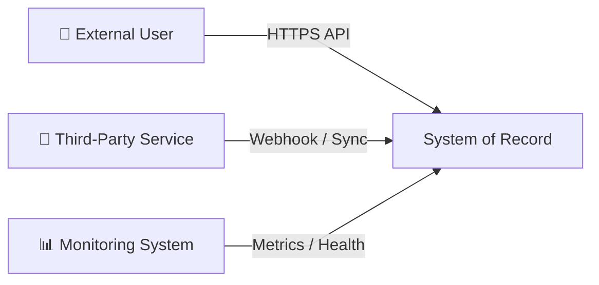
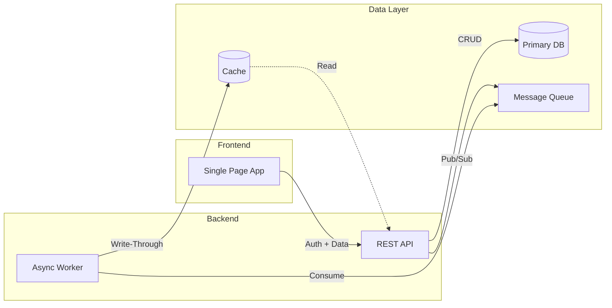
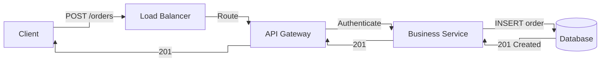
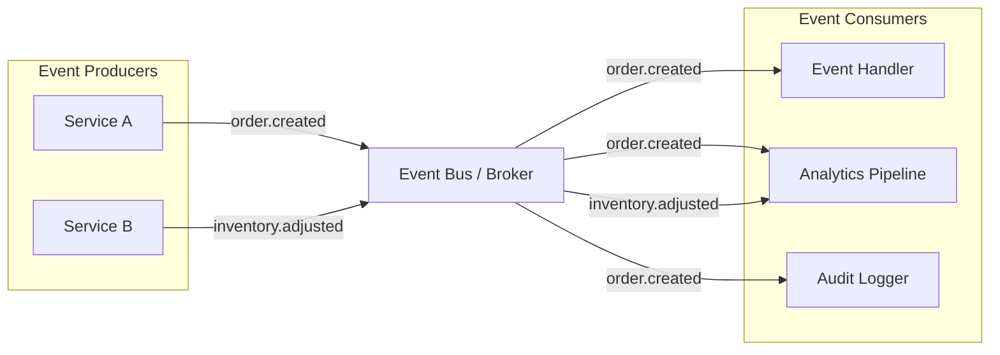
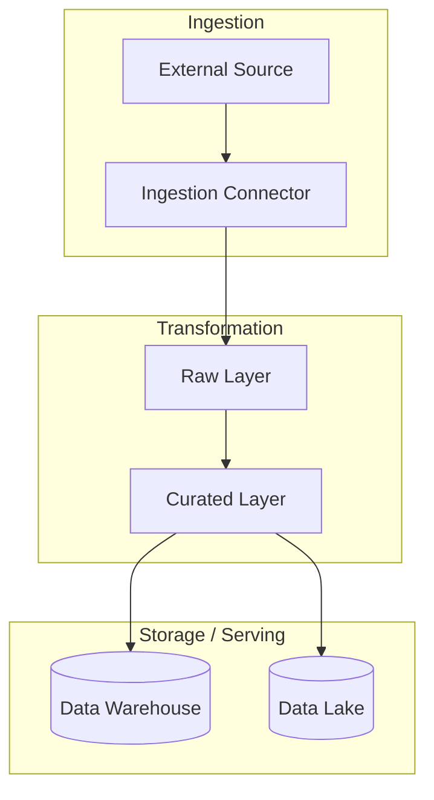
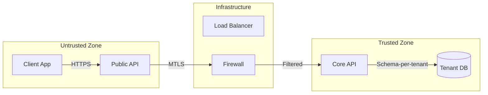
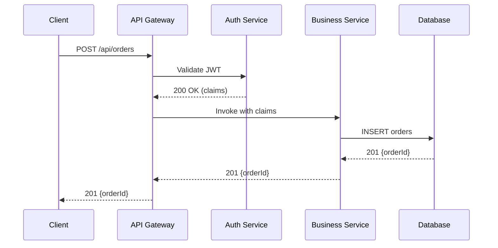
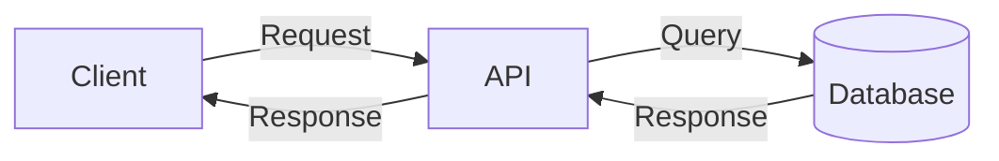

# Architecture Diagram Examples — Mermaid Reference

A collection of production-ready Mermaid diagrams for recurrent architecture documentation scenarios. Each entry documents the use case, the readability principle behind the composition, the anti-pattern to avoid, and the correct Mermaid block.

---

## 1. System Context Diagram

**Use case:** Show the system boundary and how external actors interact with it. The entry point for C4 Level 1.

**Why this composition works:** A single rounded-rectangle system node on the right, external actors on the left. One-row layout. No internal details — that's intentional. Context diagrams must stay at the boundary.

**Anti-pattern to avoid:** Including internal containers, databases, or service names at this level. That leaks implementation detail into a diagram meant for stakeholders.



**Guidance:**
- `LR` layout keeps actors and system on a single horizontal plane.
- Use icon prefixes (`👤`, `🔧`, `📊`) sparingly — they help scanners, not renderers.
- If you need to show two external systems, place them on different rows via spacing: `system["  "]` with indentation or separate them vertically using `TD` with a single row of nodes.
- Never add more than 4 external actors — beyond that, split into two context diagrams.

---

## 2. Container Interaction Diagram (C4 Level 2)

**Use case:** Show the main application boundary and how data flows through its containers (services, databases, queues).

**Why this composition works:** Three horizontal layers (Frontend, Backend, Data) via subgraphs. Each subgraph is a concern. Arrows cross layers only — never sideways within a layer. Subgraph labels are short.

**Anti-pattern to avoid:** Putting every service, queue, and database in one flat graph with all arrows crossing. A "ball-of-mud" diagram where every node points to every other node is unreadable.



**Guidance:**
- **LR** for left-to-right topology; **TD** for deep vertical nesting.
- Subgraph titles are capitalized, short nouns — `Frontend`, `Backend`, `Data Layer`.
- Edge labels are brief: `CRUD`, `Auth + Data`, `Pub/Sub`. They describe the data nature, not the protocol.
- The `cache -.-> API` dotted line signals an optional or background read path — visually distinct.
- **Rule:** if more than 3 arrows point to a single node, the node is a "gravity well." Move it to its own subgraph or introduce an intermediary.

---

## 3. Request Flow (Edge to Backend)

**Use case:** Document the critical path of an incoming request — load balancer through services to database and back. For runbooks and architecture docs where operators need to trace a call.

**Why this composition works:** A left-to-right sequence that mirrors the actual call stack. Each step is on its own row. Arrow direction is uniform (`-->`). Labels describe the action, not the protocol.

**Anti-pattern to avoid:** Mixing `sequenceDiagram` and `flowchart` syntax, or trying to show both the happy path and error paths in the same diagram. Use two diagrams (happy path + error path) instead.



**Guidance:**
- Use `stepAfter` curve for sequential, gate-like flow — arrows look like discrete steps.
- Label every edge that is non-obvious. A bare arrow between `client` and `lb` is fine; an arrow between `svc` and `db` with no label hides the operation.
- Nodes use `[""]` rectangle labels for services, `("")` for databases.
- If the flow has a branch (e.g., cache miss), add a second diagram for the alternate path. Never merge happy and error paths.

---

## 4. Event-Driven Architecture Flow

**Use case:** Show how events propagate through producers, the event bus, and consumers. Common in microservices, data platforms, and audit-log systems.

**Why this composition works:** Producers emit to one hub node; the hub fans out to consumers. The hub (event bus) is a single node, not a box — it keeps the fan-out readable. Consumers are in their own subgraph.

**Anti-pattern to avoid:** Showing a fully connected graph where every producer points to every consumer via the event bus. With 4 producers and 4 consumers, that's 16 arrows. Use a hub-and-spoke with grouping.



**Guidance:**
- **Hub-and-spoke:** one central node (the event bus) with all other nodes connecting only to it. This eliminates crossed arrows.
- Group producers and consumers in subgraphs to signal ownership and deployment boundaries.
- Event names use `noun.verb` convention (e.g., `order.created`).
- If fan-out exceeds 5 arrows from the hub, split into two event-bus diagrams or introduce an intermediary topic/queue layer.
- Use `LR` layout for event flows — the left-right orientation mirrors time (past → future).

---

## 5. Data Pipeline Flow

**Use case:** Show data moving through ingestion, transformation, and storage layers. For data engineering docs, lakehouse architectures, or ETL runbooks.

**Why this composition works:** Three vertical layers (ingest, transform, store) via subgraphs. Data flows strictly downward (`TD`). Each stage is a subgraph with a clear concern. No backward arrows.

**Anti-pattern to avoid:** Horizontal arrows between stages (ingest → transform → store should be vertical, not left-to-right). Also: mixing batch and streaming in the same diagram without a visual separator.



**Guidance:**
- **`TD`** (top-to-bottom) is the natural orientation for pipelines — stages happen sequentially.
- Each subgraph is a logical tier, not a deployment unit.
- Arrow direction is always downward — no cycles, no backward edges.
- If the pipeline has a feedback loop (e.g., monitoring triggers re-ingestion), show it as a separate diagram with a clearly labeled dashed arrow.

---

## 6. CI/CD Deployment Flow

**Use case:** Document the pipeline stages from commit to production. For onboarding, runbooks, and architecture docs.

**Why this composition works:** Stages are nodes in sequence, not subgraphs — the diagram reads left-to-right as a linear pipeline. Gates (approve, reject) use diamond decision nodes. Deployment environments are subgraph clusters.

**Anti-pattern to avoid:** Trying to show parallel jobs inside the same pipeline in a flat flowchart. Use subgraphs for parallel job groups and keep the main pipeline linear.

```mermaid
flowchart LR
    %%{ init: { "flowchart": { "curve": "stepAfter" } } }%%
    commit["Commit\n& Push"]
    build["Build &\n Unit Test"]
    integ["Integration\nTests"]
    staging["Deploy to\nStaging"]
    approve{"Approval\nGate"}
    prod["Deploy to\nProduction"}
    monitor["Monitor &\nAlert"]

    commit --> build
    build --> integ
    integ --> staging
    staging --> approve
    approve -->|"Approve"| prod
    approve -->|"Reject"| staging
    prod --> monitor
```

**Guidance:**
- Linear pipeline diagrams use `LR` with `stepAfter` curve — steps feel sequential.
- Use diamond nodes `{Label}` for human-gate decisions (`Approval Gate`).
- The `approve -->|"Reject"| staging` arrow back to staging makes the rejection path explicit. Without it, reviewers assume rejection goes to a dead-end.
- Parallel jobs (e.g., security scan running alongside integration tests) belong in a separate subgraph diagram, not merged into the main pipeline.
- If the pipeline has more than 7 stages, split into two diagrams: main flow + detailed stage expansion.

---

## 7. Multi-Tenant Boundary / Trust Boundary

**Use case:** Visualize isolation boundaries between tenants or between privileged and unprivileged zones. For security architecture and shared infrastructure docs.

**Why this composition works:** Subgraph clusters with distinct visual styling show trust zones. Cross-boundary arrows are labeled with the trust relationship they carry. Interior arrows within a zone are unlabeled — the zone itself is the trust context.

**Anti-pattern to avoid:** Showing every internal service without grouping. Without subgraph grouping, the reader cannot quickly identify which boundary an interaction crosses.



**Guidance:**
- Subgraph names describe the trust level: `Untrusted Zone`, `Trusted Zone`, `Infrastructure`.
- Cross-boundary edges are labeled with the security mechanism: `MTLS`, `HTTPS`, `Filtered`.
- No cross-zone arrows without a label — an unlabeled cross-boundary arrow hides a potential vulnerability.
- Use `direction LR` within subgraphs and `LR` at top level for clarity on boundary crossing.

---

## 8. Sequence Diagram — Critical Request Path

**Use case:** Document the exact sequence of API calls and responses in a critical flow (authentication, payment, data retrieval). For architecture decision records, API design docs, and onboarding.

**Why this composition works:** Sequence diagrams enforce a time axis by design. Each participant is a column; arrows represent messages in order. Async messages (`-->>`), return arrows (`-->), and activation boxes (`activate`/`deactivate`) are first-class syntax — no need to fake them with flowcharts.

**Anti-pattern to avoid:** Using a flowchart to show sequence — flowcharts have no time axis, so you can't clearly represent async calls, parallel invocations, or return paths without confusing label gymnastics.



**Guidance:**
- Use `participant alias as "Label"` — alias keeps code short, label provides human-readable context.
- `->>` is a solid arrow (synchronous call); `-->>` is a dotted arrow (async call); `-->>` with no return arrow is fire-and-forget.
- Return arrows (`-->>`) should mirror the call arrow type.
- Keep the participant count at 5 or fewer. More than 5 participants in a sequence diagram is a signal to split into two diagrams.
- Use `activate`/`deactivate` only when activation depth is genuinely confusing — for simple request/response flows, omit it.

---

## 9. Spaghetti Diagram — Anti-Pattern Reference

This is **what not to build**. A common mistake when systems grow organically and documentation is retrofitted rather than designed.

**The problem:** Every node connects to every other node. With 6 nodes, that's 30 edges. The renderer overlaps arrows, labels collide, and the diagram becomes unparseable.

```
❌ ANTI-PATTERN: Fully connected graph

   A → B, C, D, E, F
   B → A, C, D, E, F
   C → A, B, D, E, F
   ... (15+ edges on a 6-node graph)
```

**Why it happens:** When documentation is written after the system is built, authors feel compelled to capture "all relationships" in one diagram.

**The fix:** Pick one concern per diagram. A good architecture diagram shows ONE view: data flow, OR security boundaries, OR deployment topology — never all three at once.



**Rule of thumb:** If you need more than 3 arrows entering a single node, introduce a grouping, subgraph, or intermediary. If the diagram has more than 7 nodes, split it.

---

## Design Rules Summary

| Rule | Rationale |
|---|---|
| **One concern per diagram** | Data flow, security, and topology are three separate diagrams |
| **Max 7 nodes per diagram** | Beyond 7, cognitive load spikes; split into focused views |
| **Max 3 arrows into any node** | More creates a gravity well; group or intermediary |
| **Hub-and-spoke for fan-out** | Event bus → consumers; avoid fully connected N×M graphs |
| **LR for horizontal flows, TD for pipelines** | Orientation follows the data's natural direction |
| **Subgraphs for logical groups** | Deployment boundaries, trust zones, team ownership |
| **Edge labels on cross-boundary arrows** | Security-relevant interactions must be explicit |
| **Sequence diagram for time-critical flows** | API call sequences, auth handshakes, async messaging |
| **Flowchart for topology and data flow** | Container relationships, system boundaries, state transitions |
| **Prefer multiple focused diagrams over one sprawling diagram** | Each diagram is a reviewable unit; small diagrams age better |

---

## Layout Cheat Sheet

| Scenario | Layout | Curve | Reasoning |
|---|---|---|---|
| System topology / container diagram | `LR` | `basis` | Left-right mirrors network geography |
| Data pipeline / stage flow | `TD` | `basis` | Top-to-bottom mirrors time |
| Sequential API flow | `LR` | `stepAfter` | Discrete steps feel like gates |
| Event bus fan-out | `LR` | `basis` | Hub left, spokes right |
| Hierarchical containers | `TB` | `basis` | Inner subgraphs flow top-down |
| Multi-tenant / trust boundary | `LR` | `basis` | Left-to-right crossing zones |

---

## Quick Reference: Node Shape Guide

| Shape | Syntax | Use for |
|---|---|---|
| Rectangle | `A[Label]` | Services, APIs, applications |
| Rounded | `A(Label)` | User-facing endpoints, UI components |
| Cylinder | `A[(Label)]` | Databases, blob storage |
| Diamond | `A{Label}` | Decision gates, approval points |
| Circle | `A((Label))` | External systems, third-party services |
| Flag | `A>Label]` | Ingress points, load balancers |
| Subroutine | `A[[Label]]` | Subroutines, batch jobs |

Default (no brackets) is a stadium/oval — use `[Label]` for services to maximize readability.
