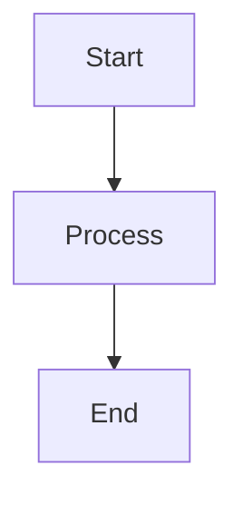
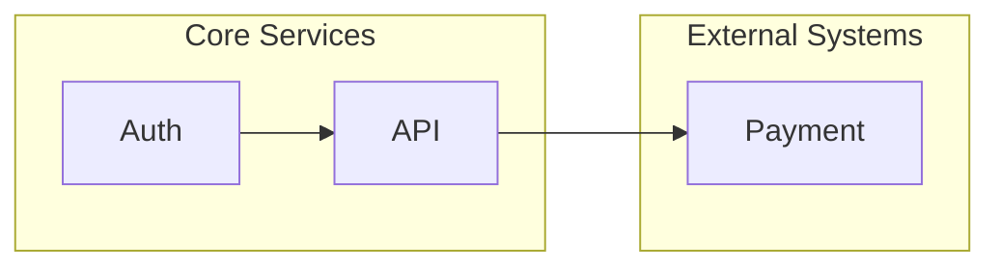
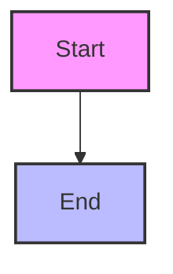

# Mermaid Diagrams in Markdown — Reference Guide

## Core Syntax

Every Mermaid diagram lives inside a fenced code block with the `mermaid` language identifier:

````markdown

````

The renderer ignores the block in non-JS environments (API responses, raw diffs) and renders it where JS is available.

## Supported Diagram Types

| Type | Keyword | Common Use Case |
|---|---|---|
| Flowchart | `flowchart` or `graph` | Process flows, decision trees |
| Sequence | `sequenceDiagram` | API calls, service interactions |
| Entity Relationship | `erDiagram` | Data models |
| Gantt | `gantt` | Project timelines |
| Class | `classDiagram` | OOP structure (avoid for docs) |
| State | `stateDiagram` | State machines |
| Journey | `journey` | User stories |
| Pie | `pie` | Simple distribution |
| Requirement | `requirementDiagram` | Traceability |
| Git (commit graph) | `gitGraph` | Version history |

Prefer **flowchart** and **sequence** for architecture docs. Use others only when they genuinely fit the model.

## Flowchart Direction

| Directive | Meaning |
|---|---|
| `TD` or `TB` | Top-to-bottom |
| `BT` | Bottom-to-top |
| `LR` | Left-to-right |
| `RL` | Right-to-left |

Left-to-right (`LR`) is preferred for wide diagrams (data flows, system topology). Top-to-bottom (`TD`) works for deep hierarchies.

## Node Shapes

```mermaid
flowchart LR
    A[Rectangle]          // default
    B(Rounded)            // parentheses
    C[[Subroutine]]        // double brackets
    D[(Database)]         // cylinder
    E((Circle))           // double circle
    F{Decision}           // diamond
    G>Flag]               // asymmetric
```

Avoid exotic shapes in shared docs. The basic rectangle `[Label]` and rounded `(Label)` cover 90% of cases.

## Connections

```mermaid
flowchart LR
    A --> B        // arrow
    A --- B       // line
    A -.-> B      // dotted arrow
    A -.->|label| B  // dotted with label
    A ==> B       // thick arrow
    A --text--> B // labeled arrow
    A -- "bold text" --> B  // styled label
    A -.- B       // open dotted (no head)
    A -->|label| B  // label on arrow
```

For labeled data flows use `-- "label text" -->`.

## Subgraphs



- Subgraph labels with spaces must be quoted: `subgraph "My Label"`
- Use subgraphs for logical grouping, not for every node
- Keep subgraph names meaningful but brief

## Styling and Themes

Use `%%` comments for human-readable notes inside the diagram.



For consistent styling across a doc set, use `%% init%%` with theme configuration at the top of the diagram, but avoid embedding raw CSS in shared references.

## Common Pitfalls

### 1. HTML tags parsed by markdown renderers

**Problem:** Content like `<row>`, `<value>` or `<input>` inside angle brackets is stripped by markdown exporters, breaking the diagram.

**Fix:** Wrap such content in quotes: `|"200(rows=<row>)"|`

### 2. AND/OR in labels

**Problem:** `AND` and `OR` are reserved parser tokens. Even in quotes they can misfire.

**Fix:** Use all-caps sparingly or replace with `&&` / `||` or phrase alternatives like `A and B`.

### 3. Markdown lists inside nodes

**Problem:** Lists like `- item` or `1. item` render as `Unsupported markdown: list`.

**Fix:** Avoid lists inside nodes. Use multiple connected nodes or plain text lines separated by `<br>` tags.

### 4. Duplicate node IDs

**Problem:** Two nodes with the same ID collapse silently.

**Fix:** Use unique identifiers even if labels repeat.

### 5. Colons in labels

**Problem:** Colons `:` are reserved in sequence diagrams.

**Fix:** Use `::` for role separators or wrap labels in quotes.

### 6. Very long labels

**Problem:** Long text without line breaks renders badly.

**Fix:** Use `<br>` for manual breaks, or markdown strings with backticks: `` `multiline<br>text` ``

## Platform Compatibility

| Platform | Mermaid Support |
|---|---|
| GitHub | Native — issues, PRs, discussions, wikis, repos |
| GitLab | Native — via Kroki or native in some contexts |
| VS Code (Markdown Preview) | Yes — with extension or native (insiders) |
| Obsidian | Native |
| Notion | Native (basic) |
| MkDocs + mermaid2 plugin | Yes |
| Docusaurus | Yes |
| Static HTML exporters (PDF, print) | No — diagrams fall back to code block |

For static export scenarios, provide a static image alternative or link to the Mermaid Live Editor with the diagram code.

## Diagram Design Rules

1. **Readable in raw text** — if the source is unreadable, the diagram is poorly designed
2. **One diagram per concern** — don't try to show architecture, data flow, and security in one diagram
3. **Label edges** — every arrow that is not self-evident needs a label
4. **Keep it shallow** — if the depth exceeds 4 levels, consider splitting into multiple diagrams
5. **Use consistent direction** — mixing LR and TD in the same doc creates visual dissonance
6. **Test on the target platform** — what renders on GitHub may differ from MkDocs or Obsidian

## Readability Rules — Avoiding Spaghetti Diagrams

### The Gravity Well Problem

A **gravity well** is a node with 4 or more incoming arrows. When many arrows converge on one node, they overlap and the diagram becomes unreadable.

**Solutions:**

1. **Introduce an intermediary node** — split one overloaded node into two (e.g., an API Gateway in front of a Business Service)
2. **Use subgraphs to group** — cluster related nodes and show the subgraph as a single edge
3. **Duplicate the hub** — for event bus scenarios, split the bus into two topics
4. **Switch to sequence diagram** — for time-ordered flows, the sequence diagram's time axis eliminates ambiguity

### The Fully Connected Trap

With N nodes, a fully connected graph has N×(N-1)/2 edges. A 6-node system has 15 edges — all of them crossing. This is the single most common architecture diagram anti-pattern.

**Solutions:**

1. **Pick one concern per diagram** — data flow OR security boundaries OR deployment topology — never all at once
2. **Hub-and-spoke** — central node connects to all others; no cross-connections between spokes
3. **Layered subgraphs** — group nodes by layer (Frontend / Backend / Data) and only allow cross-layer edges
4. **Split into multiple diagrams** — separate context, container, and component views (C4 model)

### Layout Direction Guide

| Scenario | Layout | Curve | Reasoning |
|---|---|---|---|
| System topology / container diagram | `LR` | `basis` | Left-right mirrors network geography |
| Data pipeline / stage flow | `TD` | `basis` | Top-to-bottom mirrors time |
| Sequential API flow | `LR` | `stepAfter` | Discrete steps feel like gates |
| Event bus fan-out | `LR` | `basis` | Hub left, spokes right |
| Hierarchical containers | `TB` | `basis` | Inner subgraphs flow top-down |
| Multi-tenant / trust boundary | `LR` | `basis` | Left-to-right crossing zones |

### Subgraph Composition Rules

1. **Group by concern, not by deployment** — one subgraph per team, layer, or trust zone
2. **Label subgraph boundaries explicitly** — a subgraph named `["Trusted Zone"]` is clear; one named `["Services"]` is not
3. **Prefer LR direction inside subgraphs** when the parent is `LR`; use `TB` for nested hierarchies
4. **Cross-boundary edges must be labeled** — an unlabeled arrow crossing a trust boundary hides a security-relevant interaction

### Node Count Budget

- **7 nodes maximum** per flowchart — beyond this, split into focused views
- **5 participants maximum** per sequence diagram — beyond this, the column density obscures the flow
- **3 arrows maximum** entering any single node — if you hit 4+, introduce a grouping or intermediary

### When to Use Sequence vs. Flowchart

| Use Sequence Diagram | Use Flowchart |
|---|---|
| API call sequences and request paths | System topology and container relationships |
| Authentication handshakes | Event-driven architecture (hub-and-spoke) |
| Microservice orchestration | Data pipeline flows |
| Time-ordered interactions with async calls | Decision trees and state machines |
| Service-to-service messaging with returns | Trust boundary and multi-tenant isolation |

**Rule:** If you find yourself adding `activate`/`deactivate` calls to a flowchart to show time, switch to a sequence diagram.

## arc42 and ADRs Usage

For arc42 architecture documentation:

- Section 4 (solution strategy) — use `flowchart LR` for deployment topology
- Section 5 (building block view) — use `flowchart TD` for container/component hierarchy
- Section 6 (runtime view) — use `sequenceDiagram` for critical flows
- Section 7 (deployment) — use `flowchart LR` with subgraphs for environments

For ADRs:

- Keep diagrams simple and single-purpose
- Place the Mermaid block after the decision context, before consequences
- If the ADR will be rendered in multiple formats, test the diagram cross-platform

## Resources

- [Mermaid Live Editor](https://mermaid.live) — test diagrams before committing
- [Official Mermaid Syntax Docs](https://mermaid.js.org/intro/) — authoritative reference
- [GitHub Mermaid Support](https://docs.github.com/en/get-started/writing-on-github/working-with-advanced-formatting/creating-diagrams)