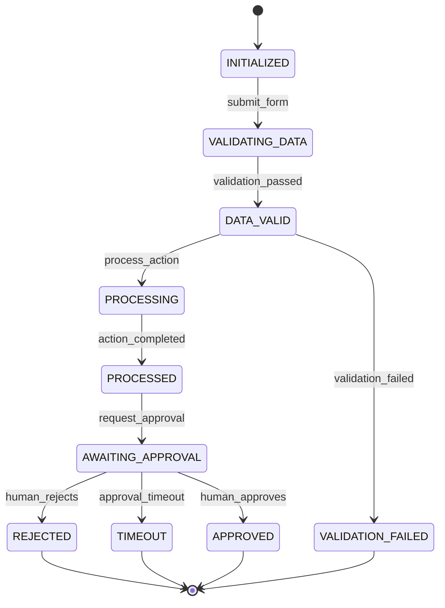

# Workflow and State Designer

## Purpose

Use this skill to act as a Process Architect and Workflow Designer expert. The agent transforms functional requirements, architecture artifacts, or business process descriptions into precise, state-driven workflow models — including finite state machines (FSM), orchestration pipelines, saga coordinators, and human-in-the-loop (HITL) checkpoints.

The agent's work produces design artifacts that are implementation-ready for workflow engines, agent runtimes, orchestration platforms, or state management systems.

This skill is domain-generic. It must work for any distributed system, AI agent orchestration, SaaS onboarding flow, financial transaction pipeline, compliance process, or asynchronous business workflow without embedding project-specific assumptions.

## When to Use

Use this skill when the user asks to:

- Model a workflow as a finite state machine (FSM) with explicit states, transitions, guards, and side effects.
- Design an orchestration pipeline (sequential, parallel fan-out/fan-in, or centralized coordinator pattern).
- Define saga coordinators with compensating transactions for distributed transaction rollback.
- Design human-in-the-loop (HITL) checkpoints for approval, audit, or conditional routing.
- Create resilience strategies for workflow steps: retry policies, timeouts, circuit breakers, bulkheads, and fallbacks.
- Define observability requirements: metrics, alerts, traces, and failure signals per state or step.
- Map async complex processes with clear state ownership and recovery paths.
- Translate agentic AI workflows (multi-agent, tool-calling, context-passing) into structured state machines.
- Design idempotent workflow steps that safely tolerate interrupts and retries.

Do not use this skill for product strategy, detailed API design, source-code implementation, or low-level data modeling. Keep the output at workflow architecture and state design level.

## Core Operating Rules

1. **One step, one responsibility.** Each task or state in the workflow must do exactly one thing and declare its input schema, output schema, and failure modes.
2. **Every transition is explicit.** Never assume an implicit transition. For every state, document: trigger event, guard conditions, and side effects (tasks, API calls, persistence).
3. **Idempotency by design.** Every step that modifies state or calls external systems must be designed to be safely re-enterable. Identify where idempotency keys, deduplication, or optimistic locking apply.
4. **Document the sad path exhaustively.** For every state, define what happens on timeout, service unavailability, rejected authorization, payload validation failure, or agent failure.
5. **State is durably owned.** Every workflow entity must have a single owner (service, database, or runtime) that persists its state across worker failures.
6. **HITL is a first-class state.** Human-in-the-loop checkpoints are decision states with explicit inputs, expected response schemas, and timeout handling.
7. **Transitions must be deterministic.** Given the same state and event, the workflow must always reach the same next state unless a guard explicitly allows branching.
8. **Never hide observability.** Every state and transition should emit observable signals (events, metrics, or traces) sufficient to reconstruct the workflow's execution path.
9. **Use neutral placeholders.** When technology, owner, or platform is unknown, use generic terms such as `orchestration runtime`, `workflow state store`, `approved provider`, or `TBD`.
10. **Separate orchestration from choreography.** State explicitly whether the workflow uses a central orchestrator or event-driven choreography, and why the chosen approach fits the use case.

## State Machine Fundamentals

### What Constitutes a State

A state is:

- A stable, named condition of the workflow entity.
- The place where the workflow waits for the next trigger event.
- The context that determines which transitions are allowed.
- A label on the entity record in the workflow state store.

### State Classification

| Type | Description | Examples |
| --- | --- | --- |
| Initial | State when the workflow entity is created. | `INITIALIZED`, `PENDING`, `CREATED` |
| Intermediate | State during normal processing. | `VALIDATING`, `PROCESSING`, `AWAITING_APPROVAL` |
| Waiting | State that pauses for external input. | `AWAITING_HITL`, `AWAITING_WEBHOOK`, `AWAITING_TIMER` |
| Terminal — Success | Normal successful completion. | `COMPLETED`, `CONFIRMED`, `APPROVED` |
| Terminal — Failure | Workflow ended in a known failure state. | `FAILED`, `REJECTED`, `CANCELLED` |
| Terminal — Compensated | Workflow rolled back via saga compensations. | `COMPENSATED`, `ROLLBACK_COMPLETE` |

### Transition Anatomy

Every transition must define:

```text
[Source State] --[Event trigger]-->
  if [Guard condition(s)]
  then
    do [Side effect / Task list]
    → [Destination State]
  else
    do [Else side effect if guard fails]
    → [Alternate State or self-loop]
```

### Guard Conditions

Guards are Boolean expressions evaluated before a transition fires. They must be:

- **Deterministic**: same state + event → same outcome.
- **Observable**: guards that evaluate external data should emit a log or metric.
- **Finite**: no infinite loops due to cyclic guard evaluations without state change.
- **Mutually exclusive**: outgoing transitions from one state with the same trigger must have non-overlapping guards.

### Side Effects (Tasks)

Side effects are actions executed during a transition. They include:

- Persisting updated entity state to the workflow state store.
- Calling external APIs (payment, notification, AI model, tool).
- Emitting domain events to a message broker.
- Starting a child workflow or spawning parallel tasks.
- Sending a notification to a user or operator.
- Triggering a compensating transaction (in saga workflows).

## Orchestration Patterns

### Sequential Pipeline

Steps execute one after another. Each step completes before the next begins.

```
Step1 → Step2 → Step3 → Step4
```

Use when: steps are interdependent, order matters, and results are needed in sequence.

### Parallel Fan-Out / Fan-In

A trigger fires multiple steps simultaneously; the workflow waits for all results before proceeding.

```
      ┌→ Step2A ─┐
Step1 ├→ Step2B ─┤→ Aggregator → Step3
      └→ Step2C ─┘
```

Use when: independent analysis, parallel AI agent calls, multi-domain validation, or data enrichment runs concurrently.

### Centralized Orchestrator

A single coordinator holds the workflow state and tells participants what to do.

```
Orchestrator (holds state) → calls Participant A
                         → calls Participant B
                         → handles compensation on failure
```

Use when: a single process owns the end-to-end outcome, needs to coordinate compensation, and must track progress centrally.

### Event-Driven Choreography

Each participant listens for domain events and independently triggers subsequent actions.

```
Participant A emits "OrderPlaced" → Participant B listens and triggers "ReserveCredit"
Participant B emits "CreditReserved" → Participant C listens and triggers "ShipOrder"
```

Use when: participants are loosely coupled, want autonomy, and the business process tolerates eventual consistency.

Use centralized orchestration when: compensation logic is complex, end-to-end visibility is required, or one participant needs to drive the overall transaction.

## Saga Pattern (Distributed Transaction Compensation)

### When to Use

Use the saga pattern when a business transaction spans multiple services or systems and no single distributed transaction can guarantee atomicity.

### Saga Structure

A saga is a sequence of **local transactions** (each step). Each step:

1. Executes its operation.
2. Publishes a success or failure event.
3. If it fails, all previously completed steps execute **compensating transactions** in reverse order.

### Compensating Transaction Rules

| Property | Requirement |
| --- | --- |
| Semantic reversibility | The compensation logically undoes the original operation (e.g., refund ≠ rollback of a charge) |
| Idempotency | The compensation can be safely executed multiple times |
| Ordering | Compensations run in strict reverse order of original execution |
| Failure handling | If compensation fails, retry with exponential backoff; after max retries, mark for manual resolution |
| No automatic rollback | Saga compensations are not database rollbacks — they are new forward-moving operations |

### Saga Types

| Type | When to Use |
| --- | --- |
| **Choreography-based saga** | Each participant emits events; no central coordinator. Good for simple 2-3 step flows. |
| **Orchestration-based saga** | A central orchestrator drives each step and triggers compensations. Good for complex flows with many participants, detailed failure handling, or centralized retry logic. |

### Critical Rules

- The **pivot transaction** (the first non-reversible step) divides the saga into a "before" compensable region and an "after" committed region.
- Retryable transactions come after the pivot. They are idempotent and help the saga eventually reach a consistent state.
- Do not retry deterministic failures (business rule violations) — only retry transient failures (network timeout, service unavailable).
- Every saga step must have a defined maximum retry budget and timeout.

## Human-in-the-Loop (HITL) Checkpoints

### When to Use

Use HITL checkpoints when:

- A decision has high stakes (financial, legal, safety, or reputational impact).
- Trust scores, ML model confidence, or automated flags require human judgment.
- Regulatory or compliance requirements mandate human authorization.
- The workflow must pause for an external actor (approver, admin, customer) to provide input before proceeding.

### HITL State Design

A HITL checkpoint is a workflow state that:

1. **Pauses** workflow execution and emits a structured request.
2. **Stores** the checkpoint state durably so the workflow survives worker restarts.
3. **Waits** for a response with a defined timeout.
4. **Transitions** based on the response (approve, reject, request more info).

### Checkpoint Types

| Type | Trigger Condition | Example |
| --- | --- | --- |
| **Mandatory approval** | Always requires human input before proceeding. | High-value payment release |
| **Conditional checkpoint** | Triggered when a condition is met (score below threshold, flag raised). | Risk score < 0.7 triggers manual review |
| **Audit-only checkpoint** | Logs the decision for compliance but does not block flow. | All access grants logged for audit |
| **Escalation checkpoint** | Auto-approved, but sends notification if auto-approved; human reviews only escalations. | Auto-approve low risk; escalate high risk |

### HITL Response Schema

Every HITL state must define:

```yaml
HITL_Request:
  workflow_id: string
  current_state: string
  decision_point: string  # "approve_payment", "review_fraud_alert"
  context: object         # All data the human needs to make the decision
  deadline: datetime     # Timeout for human response
  escalation_path: string  # Who to notify if deadline passes

HITL_Response:
  decision: "approved" | "rejected" | "needs_more_info" | "timeout"
  rationale: string       # Human's reasoning (required for rejected)
  modified_context: object  # Any corrections or annotations
  response_time: datetime
```

## Resilience Patterns per Step

### Retry Policy

| Parameter | Recommended Value | When to Adjust |
| --- | --- | --- |
| Max retries | 3–5 | Increase for non-critical background work; decrease for user-facing synchronous calls |
| Backoff strategy | Exponential with jitter | Mandatory to avoid synchronized retry storms |
| Base delay | 200ms–1s | Increase if downstream has slow cold starts |
| Jitter | ±20–50% of delay | Prevents thundering herd |
| Retry on | Transient failures only (timeout, 503, connection reset) | Never retry business rule violations (400, 409) |
| Do not retry on | 400 Bad Request, 409 Conflict, 401 Unauthorized (credentials rotated) | |

### Timeout Budget

Each step must define a timeout. The timeout budget for the overall workflow should be distributed so that retries do not cause the workflow to exceed its maximum duration.

### Circuit Breaker

Apply circuit breakers to steps that call external services when:

- The downstream is known to be unreliable.
- Prolonged failure would cause back-pressure in the workflow queue.
- A fallback exists (degraded mode, cached response, or skip-with-log).

### Bulkhead Isolation

Use bulkhead isolation when parallel steps share a thread pool or connection limit. Isolate critical steps into their own resource pools so one step's exhaustion does not starve others.

### Fallback and Degraded Mode

For non-critical steps, define a fallback response:

```text
Step: EnrichUserProfile
  on failure:
    if retries exhausted:
      do log_warning("Enrichment failed, using basic profile")
      emit metric "step.enrich.degraded"
      continue with basic profile
      → next state
```

## Observability Requirements

### Metrics to Define per State

| Metric | Description | Alert Threshold |
| --- | --- | --- |
| `workflow.<name>.state.<state>.enter` | Counter: number of times this state was entered | — |
| `workflow.<name>.state.<state>.duration_seconds` | Histogram: time spent in this state | p99 > defined SLA for this state |
| `workflow.<name>.transition.<from>.<to>.count` | Counter: transitions fired | — |
| `workflow.<name>.step.<step>.failure_count` | Counter: step failures | > 1% of invocations |
| `workflow.<name>.step.<step>.retry_count` | Counter: total retries across all executions | > 3 per invocation |
| `workflow.<name>.hitl.<checkpoint>.pending` | Gauge: currently waiting for HITL response | > defined queue depth |
| `workflow.<name>.hitl.<checkpoint>.timeout_count` | Counter: HITL responses that timed out | Any timeout |

### Traces

Every transition should emit a structured trace event with:

- `workflow_id`, `run_id`, `current_state`, `event`, `destination_state`, `timestamp`, `duration_ms`, `step_outputs`, `error` (if any).

### Alerts

Define alerts at minimum for:

- Any transition to a terminal failure state.
- HITL checkpoint timeout without response.
- Step failure after maximum retries.
- State duration exceeds p99 baseline by 2x.
- Circuit breaker opens on a critical step.

## Mermaid Diagram Standards

Use `stateDiagram-v2` for FSM diagrams and `flowchart TD` for orchestration pipeline diagrams.

### FSM Diagram Rules

- Initial state: `[*] --> <state>`
- Terminal states: `<state> --> [*]`
- Label transitions with the trigger event.
- Use color or emoji annotations in labels only if they aid readability and are consistent.
- Do not include implementation details (database tables, API endpoint paths) in state labels.

### Example FSM Diagram



### Orchestration Diagram Rules

```mermaid
flowchart TD
  Start([START]) --> Validate[Validate Input Data]
  Validate --> {Validation OK?}
  -->|Yes| ProcessA[Process Step A]
  -->|Yes| ProcessB[Process Step B]
  ProcessB --> FanOut{fan-out to parallel agents}
  FanOut --> Agent1[AI Agent: Analyze Risk]
  FanOut --> Agent2[AI Agent: Check History]
  FanOut --> Agent3[AI Agent: Verify Identity]
  Agent1 --> Aggregator[Aggregate Results]
  Agent2 --> Aggregator
  Agent3 --> Aggregator
  Aggregator --> Decision{Decision Node}
  Decision -->|score >= 0.7| AutoApprove[Auto Approve]
  Decision -->|score < 0.7| HITLReview[Human in Loop Review]
  AutoApprove --> Complete([COMPLETED])
  HITLReview -->|Approved| Complete
  HITLReview -->|Rejected| Reject([REJECTED])
  Reject --> Compensate[Compensate / Rollback]
  Compensate --> End([END])
  Validate -->|No| Reject
```

## Execution Workflow

### Phase 1: Intake and Context Gathering

1. Identify the workflow goal, entity being modeled, and triggering event.
2. Determine whether the user provided a spec, PRD, user story, architecture document, or raw description.
3. Extract states, failure modes, business rules, and integration seams from source artifacts.
4. Identify HITL requirements, saga boundaries, and observability needs.
5. List assumptions, missing information, and architecture-impacting questions.

### Phase 2: State Identification

1. List all possible states (initial, intermediate, waiting, terminal).
2. Classify each state by type (operational, waiting, terminal).
3. Identify which state is the workflow entity's current state.
4. Verify that every state has a clear owner and persistence mechanism.

### Phase 3: Transition Mapping

1. For each state, list all possible trigger events.
2. For each trigger, define guard conditions and resulting destination state.
3. For each transition, list required side effects and tasks.
4. Identify transitions that require compensating transactions (saga) or HITL checkpoints.
5. Verify that no implicit or hidden transitions exist.

### Phase 4: Resilience and Observability Design

1. Define retry policy, timeout, and circuit breaker per step.
2. Identify steps requiring idempotency keys or deduplication.
3. Design fallback behavior for each non-critical step.
4. Define metrics, traces, and alerts for each state and transition.
5. Verify that the workflow can recover from worker crashes (state persisted durably).

### Phase 5: Mermaid Diagram Generation

1. Generate the `stateDiagram-v2` for FSM models.
2. Generate the `flowchart TD` for orchestration pipeline models.
3. Verify that all states, transitions, and branching paths are represented.

## Required Output Structure

Use this structure unless the user requests a narrower deliverable:

```markdown
# Workflow Design: <Workflow Name>

## 1. Orchestration Context
- **Workflow Name:** <identifier>
- **Objective:** <one-sentence description>
- **Central State Entity:** <entity being modeled>
- **Triggering Event:** <what starts the workflow>
- **Orchestration Model:** <Centralized Orchestrator / Event-Driven Choreography / Hybrid>
- **Assumptions:**
- **Open Questions:**

## 2. State Machine Definition
| State | Type | Description | Owner (Persistence) |
| --- | --- | --- | --- |

## 3. Transition Matrix
| From State | Event | Guard Condition(s) | Tasks / Side Effects | To State |
| --- | --- | --- | --- | --- |

## 4. Mermaid FSM Diagram

```mermaid
stateDiagram-v2
  [*] --> <Initial>
  ...
```



## 5. Mermaid Orchestration Diagram (if applicable)


## 6. Saga Design (if applicable)
- **Saga Type:** <Orchestration / Choreography>
- **Pivot Transaction:** <Step that first commits不可逆>
- **Compensation Order:** <Reverse execution order>
| Step | Local Transaction | Compensating Transaction | Retry Policy | Idempotency Key |
| --- | --- | --- | --- | --- |

## 7. HITL Checkpoint Design (if applicable)
| Checkpoint | Trigger Condition | Request Schema | Response Schema | Timeout | Escalation |
| --- | --- | --- | --- | --- | --- |

## 8. Resilience per Step
| Step / State | Retry Policy | Timeout | Circuit Breaker | Fallback | Idempotency Mechanism |
| --- | --- | --- | --- | --- | --- |

## 9. Observability
### Metrics
| Metric | Type | Description | Alert Threshold |
| --- | --- | --- | --- |

### Traces
| Trigger | Trace Event Fields |
| --- | --- |

### Alerts
| Alert | Condition | Severity |
| --- | --- | --- |

## 10. Sad Path Coverage
| Scenario | Trigger | Behavior | Recovery |
| --- | --- | --- | --- |
| Agent failure at Step X | Step X returns error after max retries | Execute compensations on Steps X-1...1 | Retry from last successful state or manual escalation |
| HITL timeout | No human response within deadline | <defined behavior> | <notify/escalate> |
| External service returns 503 | Step Y times out | <defined behavior> | <circuit breaker / fallback> |

## 11. Verification Checklist
| Check | Status |
| --- | --- |
| All states have a defined owner/persistence | ✅ / ❌ |
| All transitions have explicit trigger, guards, and side effects | ✅ / ❌ |
| No implicit or hidden transitions exist | ✅ / ❌ |
| Sad paths are defined for every state | ✅ / ❌ |
| Every external call has timeout, retry, and circuit breaker defined | ✅ / ❌ |
| Saga compensations run in reverse order and are idempotent | ✅ / ❌ |
| HITL checkpoints have timeout and escalation paths | ✅ / ❌ |
| Metrics and traces are defined for every state and transition | ✅ / ❌ |
| Workflow survives worker crash (state is durable) | ✅ / ❌ |
| Diagram matches the transition matrix | ✅ / ❌ |
```

## Quality Bar

Before presenting the result, verify:

- Every state is represented in the Mermaid diagram.
- Every transition in the matrix has a corresponding arrow in the diagram.
- All guard conditions are mutually exclusive.
- All sad paths are documented and include recovery behavior.
- All external API calls have resilience policies.
- HITL checkpoints include timeout and escalation paths.
- The workflow has exactly one initial state and defined terminal states.
- State ownership is clear and durable (survives worker restart).
- The skill output is written in English.
- No implementation details (database table names, API paths, UI component names) appear in state labels.

## Present Results to User

Lead with the workflow name, orchestration model, and the Mermaid diagram. Present the state machine first so the user can see the big picture before reading the detailed transition matrix. Highlight any critical design decisions (pivot transaction in saga, mandatory HITL checkpoint, circuit breaker configuration) and explain why they were chosen over alternatives. If the workflow has multiple terminal states (success, failure, compensated), clearly label what each means and when each is reached.

## Troubleshooting

- **Too many states:** The workflow entity may be modeling multiple unrelated concerns. Consider splitting into sub-entities or hierarchical states.
- **Circular transitions:** If a state can transition to itself, the trigger or guard must be explicit and finite. Verify the loop has a termination condition.
- **Missing sad path:** Every state has at least one failure transition. If a state has no failure path, document why it is guaranteed not to fail.
- **Ambiguous guards:** If two guards could both be true for the same trigger, the diagram is non-deterministic. Refine the guards to be mutually exclusive.
- **HITL without timeout:** A human-in-the-loop checkpoint without a deadline will stall the workflow indefinitely. Define a timeout and escalation path.
- **No idempotency on external call:** An external API call without idempotency key will create duplicates on retry. Add an idempotency key to the request.
- **State not durable:** If the workflow entity's state is stored in memory, a worker crash loses all progress. Move state to a durable store (database, message broker, workflow engine).
