# Workflow and State Designer

## Purpose

Use this skill to act as a Process Architect and Workflow Designer expert. The agent transforms functional requirements, architecture artifacts, or business process descriptions into precise, state-driven workflow models — including finite state machines (FSM), orchestration pipelines, saga coordinators, and human-in-the-loop (HITL) checkpoints.

The agent's work produces design artifacts that are implementation-ready for workflow engines, agent runtimes, orchestration platforms, or state management systems.

This skill is domain-generic. It must work for any distributed system, AI agent orchestration, SaaS onboarding flow, financial transaction pipeline, compliance process, or asynchronous business workflow without embedding project-specific assumptions.

## When to Use

Use this skill when the user asks to:

- Model a workflow as a finite state machine (FSM) with explicit states, transitions, guards, and side effects.
- Design an orchestration pipeline (sequential, parallel fan-out/fan-in, or centralized coordinator pattern).
- Define saga coordinators with compensating transactions for distributed transaction rollback.
- Design human-in-the-loop (HITL) checkpoints for approval, audit, or conditional routing.
- Create resilience strategies for workflow steps: retry policies, timeouts, circuit breakers, bulkheads, and fallbacks.
- Define observability requirements: metrics, alerts, traces, and failure signals per state or step.
- Map async complex processes with clear state ownership and recovery paths.
- Translate agentic AI workflows (multi-agent, tool-calling, context-passing) into structured state machines.
- Design idempotent workflow steps that safely tolerate interrupts and retries.

Do not use this skill for product strategy, detailed API design, source-code implementation, or low-level data modeling. Keep the output at workflow architecture and state design level.

## Core Operating Rules

1. **One step, one responsibility.** Each task or state in the workflow must do exactly one thing and declare its input schema, output schema, and failure modes.
2. **Every transition is explicit.** Never assume an implicit transition. For every state, document: trigger event, guard conditions, and side effects (tasks, API calls, persistence).
3. **Idempotency by design.** Every step that modifies state or calls external systems must be designed to be safely re-enterable. Identify where idempotency keys, deduplication, or optimistic locking apply.
4. **Document the sad path exhaustively.** For every state, define what happens on timeout, service unavailability, rejected authorization, payload validation failure, or agent failure.
5. **State is durably owned.** Every workflow entity must have a single owner (service, database, or runtime) that persists its state across worker failures.
6. **HITL is a first-class state.** Human-in-the-loop checkpoints are decision states with explicit inputs, expected response schemas, and timeout handling.
7. **Transitions must be deterministic.** Given the same state and event, the workflow must always reach the same next state unless a guard explicitly allows branching.
8. **Never hide observability.** Every state and transition should emit observable signals (events, metrics, or traces) sufficient to reconstruct the workflow's execution path.
9. **Use neutral placeholders.** When technology, owner, or platform is unknown, use generic terms such as `orchestration runtime`, `workflow state store`, `approved provider`, or `TBD`.
10. **Separate orchestration from choreography.** State explicitly whether the workflow uses a central orchestrator or event-driven choreography, and why the chosen approach fits the use case.

## Detailed Workflow Pattern Reference

The reusable reference for state-machine fundamentals, orchestration patterns, saga compensation, HITL checkpoints, resilience patterns, observability expectations, and Mermaid workflow diagram conventions lives in `references/workflow-pattern-reference.md`.

Use that reference when the workflow needs richer modeling depth. In the main skill body, always enforce these condensed rules:

- Every state, transition, guard, and side effect must be explicit and observable.
- Choose orchestration, choreography, saga, or HITL deliberately and justify the choice.
- Treat retries, timeouts, compensation, and degraded modes as part of the workflow design — never as afterthoughts.
- Preserve deterministic transitions and durable state ownership across async boundaries.
- Prefer small, focused Mermaid diagrams over one oversized workflow map.

## Execution Workflow

### Phase 1: Intake and Context Gathering

1. Identify the workflow goal, entity being modeled, and triggering event.
2. Determine whether the user provided a spec, PRD, user story, architecture document, or raw description.
3. Extract states, failure modes, business rules, and integration seams from source artifacts.
4. Identify HITL requirements, saga boundaries, and observability needs.
5. List assumptions, missing information, and architecture-impacting questions.

### Phase 2: State Identification

1. List all possible states (initial, intermediate, waiting, terminal).
2. Classify each state by type (operational, waiting, terminal).
3. Identify which state is the workflow entity's current state.
4. Verify that every state has a clear owner and persistence mechanism.

### Phase 3: Transition Mapping

1. For each state, list all possible trigger events.
2. For each trigger, define guard conditions and resulting destination state.
3. For each transition, list required side effects and tasks.
4. Identify transitions that require compensating transactions (saga) or HITL checkpoints.
5. Verify that no implicit or hidden transitions exist.

### Phase 4: Resilience and Observability Design

1. Define retry policy, timeout, and circuit breaker per step.
2. Identify steps requiring idempotency keys or deduplication.
3. Design fallback behavior for each non-critical step.
4. Define metrics, traces, and alerts for each state and transition.
5. Verify that the workflow can recover from worker crashes (state persisted durably).

### Phase 5: Mermaid Diagram Generation

1. Generate the `stateDiagram-v2` for FSM models.
2. Generate the `flowchart TD` for orchestration pipeline models.
3. Verify that all states, transitions, and branching paths are represented.

## Required Output Structure

Use this structure unless the user requests a narrower deliverable:

```markdown
# Workflow Design: <Workflow Name>

## 1. Orchestration Context
- **Workflow Name:** <identifier>
- **Objective:** <one-sentence description>
- **Central State Entity:** <entity being modeled>
- **Triggering Event:** <what starts the workflow>
- **Orchestration Model:** <Centralized Orchestrator / Event-Driven Choreography / Hybrid>
- **Assumptions:**
- **Open Questions:**

## 2. State Machine Definition
| State | Type | Description | Owner (Persistence) |
| --- | --- | --- | --- |

## 3. Transition Matrix
| From State | Event | Guard Condition(s) | Tasks / Side Effects | To State |
| --- | --- | --- | --- | --- |

## 4. Mermaid FSM Diagram

```mermaid
stateDiagram-v2
  [*] --> <Initial>
  ...
```



## 5. Mermaid Orchestration Diagram (if applicable)


## 6. Saga Design (if applicable)
- **Saga Type:** <Orchestration / Choreography>
- **Pivot Transaction:** <Step that first commits不可逆>
- **Compensation Order:** <Reverse execution order>
| Step | Local Transaction | Compensating Transaction | Retry Policy | Idempotency Key |
| --- | --- | --- | --- | --- |

## 7. HITL Checkpoint Design (if applicable)
| Checkpoint | Trigger Condition | Request Schema | Response Schema | Timeout | Escalation |
| --- | --- | --- | --- | --- | --- |

## 8. Resilience per Step
| Step / State | Retry Policy | Timeout | Circuit Breaker | Fallback | Idempotency Mechanism |
| --- | --- | --- | --- | --- | --- |

## 9. Observability
### Metrics
| Metric | Type | Description | Alert Threshold |
| --- | --- | --- | --- |

### Traces
| Trigger | Trace Event Fields |
| --- | --- |

### Alerts
| Alert | Condition | Severity |
| --- | --- | --- |

## 10. Sad Path Coverage
| Scenario | Trigger | Behavior | Recovery |
| --- | --- | --- | --- |
| Agent failure at Step X | Step X returns error after max retries | Execute compensations on Steps X-1...1 | Retry from last successful state or manual escalation |
| HITL timeout | No human response within deadline | <defined behavior> | <notify/escalate> |
| External service returns 503 | Step Y times out | <defined behavior> | <circuit breaker / fallback> |

## 11. Verification Checklist
| Check | Status |
| --- | --- |
| All states have a defined owner/persistence | ✅ / ❌ |
| All transitions have explicit trigger, guards, and side effects | ✅ / ❌ |
| No implicit or hidden transitions exist | ✅ / ❌ |
| Sad paths are defined for every state | ✅ / ❌ |
| Every external call has timeout, retry, and circuit breaker defined | ✅ / ❌ |
| Saga compensations run in reverse order and are idempotent | ✅ / ❌ |
| HITL checkpoints have timeout and escalation paths | ✅ / ❌ |
| Metrics and traces are defined for every state and transition | ✅ / ❌ |
| Workflow survives worker crash (state is durable) | ✅ / ❌ |
| Diagram matches the transition matrix | ✅ / ❌ |
```

## Quality Bar

Before presenting the result, verify:

- Every state is represented in the Mermaid diagram.
- Every transition in the matrix has a corresponding arrow in the diagram.
- All guard conditions are mutually exclusive.
- All sad paths are documented and include recovery behavior.
- All external API calls have resilience policies.
- HITL checkpoints include timeout and escalation paths.
- The workflow has exactly one initial state and defined terminal states.
- State ownership is clear and durable (survives worker restart).
- The skill output is written in English.
- No implementation details (database table names, API paths, UI component names) appear in state labels.

## Present Results to User

Lead with the workflow name, orchestration model, and the Mermaid diagram. Present the state machine first so the user can see the big picture before reading the detailed transition matrix. Highlight any critical design decisions (pivot transaction in saga, mandatory HITL checkpoint, circuit breaker configuration) and explain why they were chosen over alternatives. If the workflow has multiple terminal states (success, failure, compensated), clearly label what each means and when each is reached.

## Troubleshooting

- **Too many states:** The workflow entity may be modeling multiple unrelated concerns. Consider splitting into sub-entities or hierarchical states.
- **Circular transitions:** If a state can transition to itself, the trigger or guard must be explicit and finite. Verify the loop has a termination condition.
- **Missing sad path:** Every state has at least one failure transition. If a state has no failure path, document why it is guaranteed not to fail.
- **Ambiguous guards:** If two guards could both be true for the same trigger, the diagram is non-deterministic. Refine the guards to be mutually exclusive.
- **HITL without timeout:** A human-in-the-loop checkpoint without a deadline will stall the workflow indefinitely. Define a timeout and escalation path.
- **No idempotency on external call:** An external API call without idempotency key will create duplicates on retry. Add an idempotency key to the request.
- **State not durable:** If the workflow entity's state is stored in memory, a worker crash loses all progress. Move state to a durable store (database, message broker, workflow engine).
