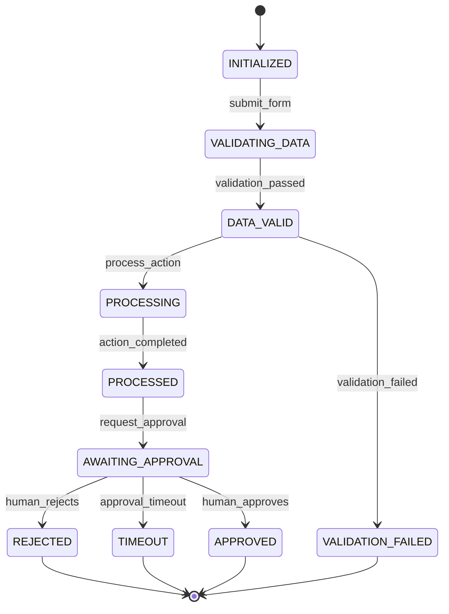

# Workflow Pattern Reference

Detailed reusable patterns referenced by `SKILL.md`.

## State Machine Fundamentals

### What Constitutes a State

A state is:

- A stable, named condition of the workflow entity.
- The place where the workflow waits for the next trigger event.
- The context that determines which transitions are allowed.
- A label on the entity record in the workflow state store.

### State Classification

| Type | Description | Examples |
| --- | --- | --- |
| Initial | State when the workflow entity is created. | `INITIALIZED`, `PENDING`, `CREATED` |
| Intermediate | State during normal processing. | `VALIDATING`, `PROCESSING`, `AWAITING_APPROVAL` |
| Waiting | State that pauses for external input. | `AWAITING_HITL`, `AWAITING_WEBHOOK`, `AWAITING_TIMER` |
| Terminal — Success | Normal successful completion. | `COMPLETED`, `CONFIRMED`, `APPROVED` |
| Terminal — Failure | Workflow ended in a known failure state. | `FAILED`, `REJECTED`, `CANCELLED` |
| Terminal — Compensated | Workflow rolled back via saga compensations. | `COMPENSATED`, `ROLLBACK_COMPLETE` |

### Transition Anatomy

Every transition must define:

```text
[Source State] --[Event trigger]-->
  if [Guard condition(s)]
  then
    do [Side effect / Task list]
    → [Destination State]
  else
    do [Else side effect if guard fails]
    → [Alternate State or self-loop]
```

### Guard Conditions

Guards are Boolean expressions evaluated before a transition fires. They must be:

- **Deterministic**: same state + event → same outcome.
- **Observable**: guards that evaluate external data should emit a log or metric.
- **Finite**: no infinite loops due to cyclic guard evaluations without state change.
- **Mutually exclusive**: outgoing transitions from one state with the same trigger must have non-overlapping guards.

### Side Effects (Tasks)

Side effects are actions executed during a transition. They include:

- Persisting updated entity state to the workflow state store.
- Calling external APIs (payment, notification, AI model, tool).
- Emitting domain events to a message broker.
- Starting a child workflow or spawning parallel tasks.
- Sending a notification to a user or operator.
- Triggering a compensating transaction (in saga workflows).

## Orchestration Patterns

### Sequential Pipeline

Steps execute one after another. Each step completes before the next begins.

```
Step1 → Step2 → Step3 → Step4
```

Use when: steps are interdependent, order matters, and results are needed in sequence.

### Parallel Fan-Out / Fan-In

A trigger fires multiple steps simultaneously; the workflow waits for all results before proceeding.

```
      ┌→ Step2A ─┐
Step1 ├→ Step2B ─┤→ Aggregator → Step3
      └→ Step2C ─┘
```

Use when: independent analysis, parallel AI agent calls, multi-domain validation, or data enrichment runs concurrently.

### Centralized Orchestrator

A single coordinator holds the workflow state and tells participants what to do.

```
Orchestrator (holds state) → calls Participant A
                         → calls Participant B
                         → handles compensation on failure
```

Use when: a single process owns the end-to-end outcome, needs to coordinate compensation, and must track progress centrally.

### Event-Driven Choreography

Each participant listens for domain events and independently triggers subsequent actions.

```
Participant A emits "OrderPlaced" → Participant B listens and triggers "ReserveCredit"
Participant B emits "CreditReserved" → Participant C listens and triggers "ShipOrder"
```

Use when: participants are loosely coupled, want autonomy, and the business process tolerates eventual consistency.

Use centralized orchestration when: compensation logic is complex, end-to-end visibility is required, or one participant needs to drive the overall transaction.

## Saga Pattern (Distributed Transaction Compensation)

### When to Use

Use the saga pattern when a business transaction spans multiple services or systems and no single distributed transaction can guarantee atomicity.

### Saga Structure

A saga is a sequence of **local transactions** (each step). Each step:

1. Executes its operation.
2. Publishes a success or failure event.
3. If it fails, all previously completed steps execute **compensating transactions** in reverse order.

### Compensating Transaction Rules

| Property | Requirement |
| --- | --- |
| Semantic reversibility | The compensation logically undoes the original operation (e.g., refund ≠ rollback of a charge) |
| Idempotency | The compensation can be safely executed multiple times |
| Ordering | Compensations run in strict reverse order of original execution |
| Failure handling | If compensation fails, retry with exponential backoff; after max retries, mark for manual resolution |
| No automatic rollback | Saga compensations are not database rollbacks — they are new forward-moving operations |

### Saga Types

| Type | When to Use |
| --- | --- |
| **Choreography-based saga** | Each participant emits events; no central coordinator. Good for simple 2-3 step flows. |
| **Orchestration-based saga** | A central orchestrator drives each step and triggers compensations. Good for complex flows with many participants, detailed failure handling, or centralized retry logic. |

### Critical Rules

- The **pivot transaction** (the first non-reversible step) divides the saga into a "before" compensable region and an "after" committed region.
- Retryable transactions come after the pivot. They are idempotent and help the saga eventually reach a consistent state.
- Do not retry deterministic failures (business rule violations) — only retry transient failures (network timeout, service unavailable).
- Every saga step must have a defined maximum retry budget and timeout.

## Human-in-the-Loop (HITL) Checkpoints

### When to Use

Use HITL checkpoints when:

- A decision has high stakes (financial, legal, safety, or reputational impact).
- Trust scores, ML model confidence, or automated flags require human judgment.
- Regulatory or compliance requirements mandate human authorization.
- The workflow must pause for an external actor (approver, admin, customer) to provide input before proceeding.

### HITL State Design

A HITL checkpoint is a workflow state that:

1. **Pauses** workflow execution and emits a structured request.
2. **Stores** the checkpoint state durably so the workflow survives worker restarts.
3. **Waits** for a response with a defined timeout.
4. **Transitions** based on the response (approve, reject, request more info).

### Checkpoint Types

| Type | Trigger Condition | Example |
| --- | --- | --- |
| **Mandatory approval** | Always requires human input before proceeding. | High-value payment release |
| **Conditional checkpoint** | Triggered when a condition is met (score below threshold, flag raised). | Risk score < 0.7 triggers manual review |
| **Audit-only checkpoint** | Logs the decision for compliance but does not block flow. | All access grants logged for audit |
| **Escalation checkpoint** | Auto-approved, but sends notification if auto-approved; human reviews only escalations. | Auto-approve low risk; escalate high risk |

### HITL Response Schema

Every HITL state must define:

```yaml
HITL_Request:
  workflow_id: string
  current_state: string
  decision_point: string  # "approve_payment", "review_fraud_alert"
  context: object         # All data the human needs to make the decision
  deadline: datetime     # Timeout for human response
  escalation_path: string  # Who to notify if deadline passes

HITL_Response:
  decision: "approved" | "rejected" | "needs_more_info" | "timeout"
  rationale: string       # Human's reasoning (required for rejected)
  modified_context: object  # Any corrections or annotations
  response_time: datetime
```

## Resilience Patterns per Step

### Retry Policy

| Parameter | Recommended Value | When to Adjust |
| --- | --- | --- |
| Max retries | 3–5 | Increase for non-critical background work; decrease for user-facing synchronous calls |
| Backoff strategy | Exponential with jitter | Mandatory to avoid synchronized retry storms |
| Base delay | 200ms–1s | Increase if downstream has slow cold starts |
| Jitter | ±20–50% of delay | Prevents thundering herd |
| Retry on | Transient failures only (timeout, 503, connection reset) | Never retry business rule violations (400, 409) |
| Do not retry on | 400 Bad Request, 409 Conflict, 401 Unauthorized (credentials rotated) | |

### Timeout Budget

Each step must define a timeout. The timeout budget for the overall workflow should be distributed so that retries do not cause the workflow to exceed its maximum duration.

### Circuit Breaker

Apply circuit breakers to steps that call external services when:

- The downstream is known to be unreliable.
- Prolonged failure would cause back-pressure in the workflow queue.
- A fallback exists (degraded mode, cached response, or skip-with-log).

### Bulkhead Isolation

Use bulkhead isolation when parallel steps share a thread pool or connection limit. Isolate critical steps into their own resource pools so one step's exhaustion does not starve others.

### Fallback and Degraded Mode

For non-critical steps, define a fallback response:

```text
Step: EnrichUserProfile
  on failure:
    if retries exhausted:
      do log_warning("Enrichment failed, using basic profile")
      emit metric "step.enrich.degraded"
      continue with basic profile
      → next state
```

## Observability Requirements

### Metrics to Define per State

| Metric | Description | Alert Threshold |
| --- | --- | --- |
| `workflow.<name>.state.<state>.enter` | Counter: number of times this state was entered | — |
| `workflow.<name>.state.<state>.duration_seconds` | Histogram: time spent in this state | p99 > defined SLA for this state |
| `workflow.<name>.transition.<from>.<to>.count` | Counter: transitions fired | — |
| `workflow.<name>.step.<step>.failure_count` | Counter: step failures | > 1% of invocations |
| `workflow.<name>.step.<step>.retry_count` | Counter: total retries across all executions | > 3 per invocation |
| `workflow.<name>.hitl.<checkpoint>.pending` | Gauge: currently waiting for HITL response | > defined queue depth |
| `workflow.<name>.hitl.<checkpoint>.timeout_count` | Counter: HITL responses that timed out | Any timeout |

### Traces

Every transition should emit a structured trace event with:

- `workflow_id`, `run_id`, `current_state`, `event`, `destination_state`, `timestamp`, `duration_ms`, `step_outputs`, `error` (if any).

### Alerts

Define alerts at minimum for:

- Any transition to a terminal failure state.
- HITL checkpoint timeout without response.
- Step failure after maximum retries.
- State duration exceeds p99 baseline by 2x.
- Circuit breaker opens on a critical step.

## Mermaid Diagram Standards

Use `stateDiagram-v2` for FSM diagrams and `flowchart TD` for orchestration pipeline diagrams.

### FSM Diagram Rules

- Initial state: `[*] --> <state>`
- Terminal states: `<state> --> [*]`
- Label transitions with the trigger event.
- Use color or emoji annotations in labels only if they aid readability and are consistent.
- Do not include implementation details (database tables, API endpoint paths) in state labels.

### Example FSM Diagram



### Orchestration Diagram Rules

```mermaid
flowchart TD
  Start([START]) --> Validate[Validate Input Data]
  Validate --> {Validation OK?}
  -->|Yes| ProcessA[Process Step A]
  -->|Yes| ProcessB[Process Step B]
  ProcessB --> FanOut{fan-out to parallel agents}
  FanOut --> Agent1[AI Agent: Analyze Risk]
  FanOut --> Agent2[AI Agent: Check History]
  FanOut --> Agent3[AI Agent: Verify Identity]
  Agent1 --> Aggregator[Aggregate Results]
  Agent2 --> Aggregator
  Agent3 --> Aggregator
  Aggregator --> Decision{Decision Node}
  Decision -->|score >= 0.7| AutoApprove[Auto Approve]
  Decision -->|score < 0.7| HITLReview[Human in Loop Review]
  AutoApprove --> Complete([COMPLETED])
  HITLReview -->|Approved| Complete
  HITLReview -->|Rejected| Reject([REJECTED])
  Reject --> Compensate[Compensate / Rollback]
  Compensate --> End([END])
  Validate -->|No| Reject
```
